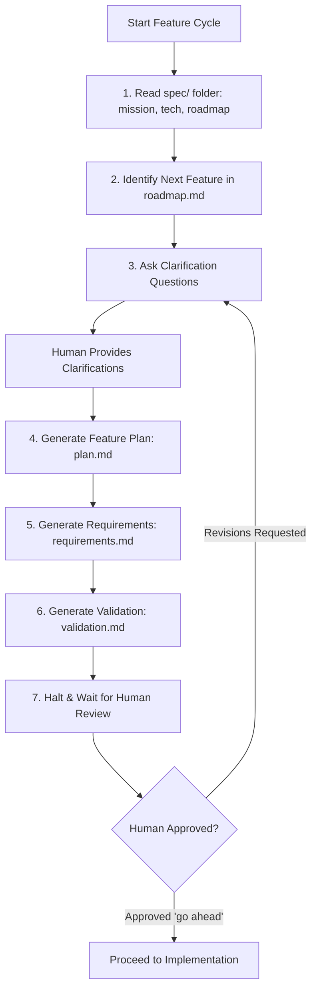

# SDD Feature Validation Skill (`feature-validation`)

This skill defines and enforces the mandatory pre-implementation specification cycle for any new feature in this repository.

> 🧠 **Spec = Brain**  
> 💪 **Agent = Muscle**  
> 👨‍💻 **Human = Architect / Supervisor**

Before writing **any** application code or modifying existing business logic for a new feature, you must strictly execute the following 7 steps in sequence:

---

## The 7 Mandatory Pre-Implementation Rules

### 1. Read `spec/` Folder in Root Directory
- Always read the project constitution files using `view_file`:
  - [`spec/mission.md`](file:///d:/AI%20Projects/voice_agent/spec/mission.md): Understand the WHAT, WHY, target users, and boundaries.
  - [`spec/tech.md`](file:///d:/AI%20Projects/voice_agent/spec/tech.md): Verify architectural invariants, tech stack selections, and SLA budgets (e.g. voice latency < 800ms, barge-in rules).
  - [`spec/roadmap.md`](file:///d:/AI%20Projects/voice_agent/spec/roadmap.md): Understand completed milestones and current project trajectory.

### 2. Identify Next Feature in `roadmap.md`
- Inspect [`spec/roadmap.md`](file:///d:/AI%20Projects/voice_agent/spec/roadmap.md) to locate the active phase.
- Select the first uncompleted feature (e.g., `Feature 5.1: Main Dashboard Entry`).
- Confirm that all prerequisite phases and foundational components are satisfied.

### 3. Ask Clarification Questions
- Analyze potential ambiguities, design trade-offs, and underspecified requirements.
- Formulate clear, concise questions for the human supervisor:
  - Scope boundaries (what is in/out of scope for this specific feature).
  - UI/UX layout, visual design, and styling preferences.
  - Error handling behavior and edge cases.
- **Do not guess or assume intent.** Wait for human input when ambiguity exists.

### 4. Generate Feature Plan (`plan.md`)
- Create `spec/features/feature-XXX-<feature-name>/plan.md`.
- Document:
  - **Objective**: Clear statement of what this feature accomplishes.
  - **Approach & Architecture**: Component layout, data flow, and interactions with existing modules.
  - **Files to Create / Modify**: Explicit list of target paths.
  - **Execution Breakdown**: Atomic sub-steps for implementation.

### 5. Generate Requirements (`requirements.md`)
- Create `spec/features/feature-XXX-<feature-name>/requirements.md`.
- Write testable, clear requirements:
  - **Functional Requirements (R1, R2, ...)**: What the system must do.
  - **Non-Functional Requirements**: Latency budgets, responsiveness, accessibility, theme consistency.
  - **Constraints**: What the feature must *not* do or change.
- **Rule**: Document decisions and behaviors, NOT trivial implementation micro-details (e.g. variable names).

### 6. Generate Validation Criteria (`validation.md`)
- Create `spec/features/feature-XXX-<feature-name>/validation.md`.
- Define explicit, falsifiable criteria to verify correctness:
  - **Automated Verification**: Commands to run (`pytest tests/...`, CLI runner scripts).
  - **Expected Results**: Return codes, JSON schemas, UI component presence.
  - **Edge Case Tests**: Negative inputs, timeout handling, disconnection resilience.
  - **Manual / Visual Checks**: Specific browser actions (`streamlit run src/dashboard/app.py`), expected visuals, and interactive behaviors.

### 7. Wait for Human Review (Mandatory Gate) 🛑
- **Halt all coding activity immediately.**
- Present the generated specification files (`plan.md`, `requirements.md`, `validation.md`) to the human supervisor.
- Highlight key decisions, trade-offs, and open questions.
- **Strict Prohibition**: Never write application code or make edits before receiving explicit approval (e.g., *"go ahead"*, *"approved"*, *"اعتمد"*).

---

## Post-Implementation Checklist

Once human approval is granted and code is written:
1. **Execute Validation**: Run every test and validation command specified in `validation.md`.
2. **Review Diff**: Ensure changes are clean, minimal, and free of architectural drift.
3. **Update Tracking**: Mark completed checkboxes in [`spec/roadmap.md`](file:///d:/AI%20Projects/voice_agent/spec/roadmap.md) and [`TASK_PLAN.md`](file:///d:/AI%20Projects/voice_agent/TASK_PLAN.md).
4. **Git Checkpoint**: Commit with semantic commit message and push to GitHub repository.
5. **Replanning**: Pause to reflect on lessons learned and update specs before starting the next feature cycle.
