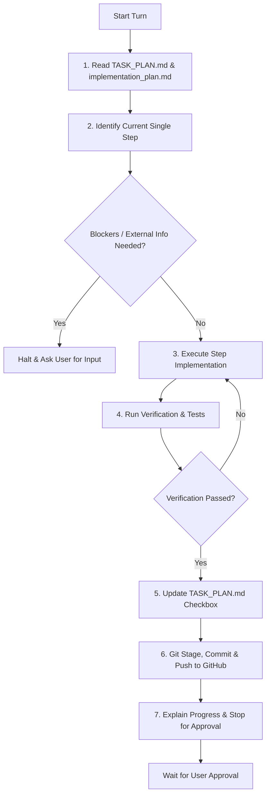

# Workspace Execution Rules Skill (`my-rule`)

This skill defines and enforces the workspace operational workflow, step-by-step execution discipline, session persistence, and Git synchronization protocols across all tasks.

> **Execution vs. Explanation**:
> - **Default Mode**: Provide a structured, concise summary of changes ("what was done, why, verification results, and git status").
> - **Teaching Mode**: Do **not** invoke the separate 6-step AI teaching methodology unless the user explicitly requests an in-depth lesson or conceptual breakdown.



---

## 1. Session Memory & Plan Persistence

### 1.1 Mandatory Plan Locations
- Both `implementation_plan.md` and `TASK_PLAN.md` must live directly in the workspace root directory:
  - `implementation_plan.md`
  - `TASK_PLAN.md`
- Never relocate or delete these files.

### 1.2 Explicit Plan Verification Protocol
- **Before taking any action or writing code**: Always read `TASK_PLAN.md` and `implementation_plan.md` using `view_file`.
- Verify the current phase, completed tasks (`- [x]`), and the exact next pending task (`- [ ]`).
- Ground every decision in the approved implementation plan.

### 1.3 Task Tracking & State Updates
- Immediately upon completing and verifying a step, update the corresponding item in `TASK_PLAN.md` from `- [ ]` to `- [x]`.
- Keep `TASK_PLAN.md` and `implementation_plan.md` in sync with actual repository state.

---

## 2. Step-by-Step Task Execution Protocol

### 2.1 Atomic Execution (One Step at a Time)
- **Strict Rule**: Execute exactly **ONE** plan step per conversation turn.
- Never batch multiple distinct plan steps into a single turn.
- Keep changes scoped strictly to what is required for the active step.

### 2.2 Pre-Execution Validation
- Confirm all prerequisite steps and dependencies are in place.
- Review existing code structure, types, and imports before authoring new modules.

### 2.3 Verification & Quality Assurance
- Every code change or new file must be verified before considering the step complete:
  - Run unit tests or smoke test scripts (`pytest`, `python -m ...`).
  - Check syntax and type compatibility.
  - Validate configuration schemas.
- If verification fails, diagnose and resolve the issue before committing.

### 2.4 Handling External Dependencies & Blockers
- If a step requires external resources (e.g., API keys, HuggingFace tokens, AWS credentials, GPU compute access):
  - **Immediately stop execution.**
  - Clearly explain what is needed and why.
  - Wait for the user to provide the required resource.

### 2.5 Autonomous Execution (No Conversational Questions)
- **Zero Conversational Questions**: Complete tasks autonomously without asking questions, asking for preferences, or pausing for trivial clarifications during conversation.
- **Decisive Decision Making**: Apply standard industry best practices and make sound architectural and technical decisions directly aligned with `TASK_PLAN.md` and `implementation_plan.md`.
- **Direct Reporting**: Deliver clear progress reports at the end of each step without interrogative or conversational questions.

---

## 3. Git Synchronization & Checkpointing Protocol

### 3.1 Clean Staging & Status Inspection
- Run `git status` to inspect all modified and untracked files.
- Ensure temporary files, virtual environments, cache directories (`__pycache__`, `.pytest_cache`), or secret files (`.env`) are excluded via `.gitignore`.

### 3.2 Semantic Commit Messages
- Format commit messages using standard Conventional Commits:
  - `feat(<phase/scope>): <clear, concise description of addition>`
  - `fix(<phase/scope>): <description of fix>`
  - `refactor(<phase/scope>): <description of refactoring>`
  - `test(<phase/scope>): <description of tests added>`
  - `docs(<phase/scope>): <description of documentation updates>`

### 3.3 Remote Push
- Stage all relevant files: `git add <files>` and `git add TASK_PLAN.md`.
- Commit changes: `git commit -m "<semantic message>"`.
- Push to GitHub remote: `git push origin <branch>`.
- Confirm the push succeeded without errors.

---

## 4. Progress Reporting & Approval Gate

### 4.1 Structured Progress Summary Template
After completing a step and pushing to GitHub, summarize the progress using this structured format:

```markdown
### 📌 Completed Step: [Step Name / Number]

#### 🛠️ What Was Done
- **[File Name](file:///path/to/file)**: Summary of specific classes, functions, or configurations implemented.
- **[File Name 2](file:///path/to/file2)**: Summary of modifications.

#### 💡 Rationale & Design Decisions
- Brief explanation of why this implementation structure was chosen and how it fits the architecture.

#### 🧪 Verification & Testing
- Command run: `pytest tests/test_module.py` (or smoke script)
- Result: Output confirming passes and expected behavior.

#### 🚀 Git Checkpoint
- **Commit**: `[commit_hash] <commit_message>`
- **Status**: Pushed to `origin/<branch>` (working tree clean).

---

### 🛑 Next Step & Approval Request
- **Next Step**: `[Name of next step from TASK_PLAN.md]`
- Please review the changes above and let me know if you would like me to proceed.
```

### 4.2 Strict User Approval Gate
- **Do not proceed automatically** to the next step under any circumstances.
- Always stop and wait for explicit permission/approval (e.g., "go ahead", "proceed", "yes") from the user.

---

## 5. Error Handling & Rollback Protocol

| Scenario | Protocol |
| :--- | :--- |
| **Verification / Test Failure** | Do not update `TASK_PLAN.md` or commit. Inspect error traceback, fix the code, and re-run verification until green. |
| **Git Push Failure / Conflict** | Inspect remote status (`git status`, `git pull --rebase` if appropriate). Do not force push unless explicitly instructed. |
| **Missing External Secret / Credential** | Halt immediately. Provide the exact variable name and instructions for where to set it (e.g., `.env`). |
| **Plan Revision Needed** | If implementation reveals a missing architectural component, update `implementation_plan.md` and request user approval before deviating. |

---

## Summary Checklist for Every Turn

- [ ] Read `TASK_PLAN.md` and `implementation_plan.md` via `view_file`.
- [ ] Implement exactly ONE step.
- [ ] Verify functionality / run tests.
- [ ] Update `TASK_PLAN.md` checkbox `- [x]`.
- [ ] Commit and push to GitHub repository.
- [ ] Output structured progress summary.
- [ ] Stop and request user approval to proceed.
---

## 6. Language & Communication Rules

1. **Autonomous Execution**: Complete tasks decisively without asking questions in the conversation. Make standard engineering decisions autonomously according to the implementation plan.
2. **Arabic Explanations**: When explaining progress and changes, write the explanation in clear, professional Arabic with clean left-to-right formatting.