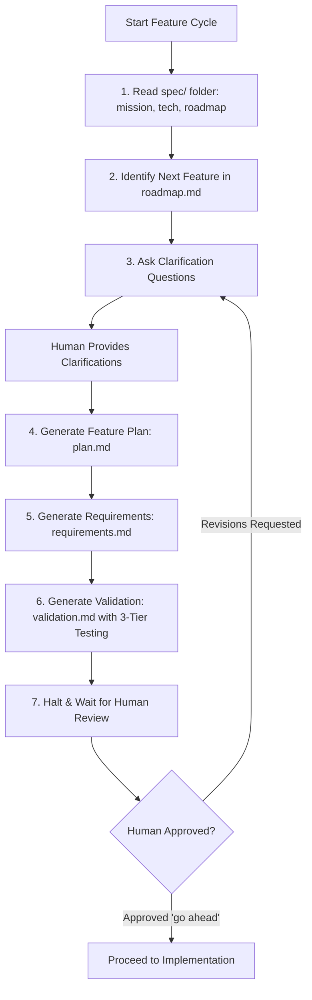

# SDD Feature Validation Skill (`feature-validation`)

This skill defines and enforces the mandatory pre-implementation specification cycle for any new feature in this repository.

> 🧠 **Spec = Brain**  
> 💪 **Agent = Muscle**  
> 👨‍💻 **Human = Architect / Supervisor**

Before writing **any** application code or modifying existing business logic for a new feature, you must strictly execute the following 7 steps in sequence:

```mermaid
flowchart TD
    A[Start Feature Cycle] --> B[1. Read spec/ folder: mission, tech, roadmap]
    B --> C[2. Identify Next Feature in roadmap.md]
    C --> D[3. Ask Clarification Questions]
    D --> E[Human Provides Clarifications]
    E --> F[4. Generate Feature Plan: plan.md]
    F --> G[5. Generate Requirements: requirements.md]
    G --> H[6. Generate Validation: validation.md with 3-Tier Testing]
    H --> I[7. Halt & Wait for Human Review]
    I --> J{Human Approved?}
    J -- Revisions Requested --> D
    J -- Approved 'go ahead' --> K[Proceed to Implementation]
```

---

## The 7 Mandatory Pre-Implementation Rules

### 1. Read `spec/` Folder in Root Directory
- Always read the project constitution files using `view_file`:
  - `spec/mission.md`: Understand the WHAT, WHY, target users, and boundaries.
  - `spec/tech.md`: Verify architectural invariants, tech stack selections, and SLA budgets (e.g. voice latency < 800ms, barge-in rules).
  - `spec/roadmap.md`: Understand completed milestones and current project trajectory.

### 2. Identify Next Feature in `roadmap.md`
- Inspect `spec/roadmap.md` to locate the active phase.
- Select the first uncompleted feature (e.g., `Feature 5.1: Main Dashboard Entry`).
- Confirm that all prerequisite phases and foundational components are satisfied.

### 3. Ask Clarification Questions
- Analyze potential ambiguities, design trade-offs, and underspecified requirements.
- Formulate clear, concise questions for the human supervisor:
  - Scope boundaries (what is in/out of scope for this specific feature).
  - UI/UX layout, visual design, and styling preferences.
  - Error handling behavior and edge cases.
- **Do not guess or assume intent.** Wait for human input when ambiguity exists.

### 4. Generate Feature Plan (`plan.md`)
- Create `spec/features/feature-XXX-<feature-name>/plan.md`.
- Document:
  - **Objective**: Clear statement of what this feature accomplishes.
  - **Approach & Architecture**: Component layout, data flow, and interactions with existing modules.
  - **Files to Create / Modify**: Explicit list of target paths.
  - **Execution Breakdown**: Atomic sub-steps for implementation.

### 5. Generate Requirements (`requirements.md`)
- Create `spec/features/feature-XXX-<feature-name>/requirements.md`.
- Write testable, clear requirements:
  - **Functional Requirements (R1, R2, ...)**: What the system must do.
  - **Non-Functional Requirements**: Latency budgets, responsiveness, accessibility, theme consistency.
  - **Constraints**: What the feature must *not* do or change.
- **Rule**: Document decisions and behaviors, NOT trivial implementation micro-details (e.g. variable names).

### 6. Generate Validation Criteria (`validation.md`) with 3-Tier Testing
- Create `spec/features/feature-XXX-<feature-name>/validation.md`.
- Enforce the 3-tier testing architecture:
  - **Tier 1: Unit Tests**:
    - Isolated tests for factories, helpers, schemas, and configurations.
    - Validate defaults and parameter overrides without external dependencies.
  - **Tier 2: Integration Tests**:
    - Multi-component collaboration (e.g., Tool + `CallSession` + Storage/RAG).
    - Verify state mutations, conversation messages, and telemetry metrics.
  - **Tier 3: Error & Edge Case Tests**:
    - Simulate failures (database outages, API timeouts, invalid inputs).
    - Assert defensive resilience: system must never crash and must return polite fallback responses.
  - **Applicability & Exemption Rule** ⚖️:
    - Do **not** fabricate artificial tests across all 3 tiers if one tier is genuinely not applicable.
    - **Rule**: All *applicable* testing tiers MUST be defined.
    - **Exemption Requirement**: If a tier is not applicable, `validation.md` MUST explicitly declare the exemption with a clear technical justification.
    - *Example*:
      > **Tier 2: Integration Tests**  
      > *Status*: Not Applicable  
      > *Justification*: This feature contains a pure, isolated formatting utility with no cross-component behavior or persistent state mutation.
  - **Test Isolation Invariant**:
    - Mandate pristine test fixtures (e.g., `fresh_session`) to guarantee zero cross-test pollution and order-independent execution.
  - **Automated Verification Commands**:
    - Exact pytest CLI commands (e.g., `uv run pytest tests/test_... -v`).
  - **Manual / Visual Checks**:
    - Browser interactions (`streamlit run src/dashboard/app.py`), UI layout verification, and CLI runners (`python scripts/test_call.py`).

### 7. Wait for Human Review (Mandatory Gate) 🛑
- **Halt all coding activity immediately.**
- Present the generated specification files (`plan.md`, `requirements.md`, `validation.md`) to the human supervisor.
- Highlight key decisions, trade-offs, and open questions.
- **Strict Prohibition**: Never write application code or make edits before receiving explicit approval (e.g., *"go ahead"*, *"approved"*, *"اعتمد"*).

---

## Post-Implementation Checklist

Once human approval is granted and code is written:
1. **Execute Validation**: Run every test across all 3 tiers (Unit, Integration, Edge/Exception) and manual checks specified in `validation.md` (`uv run pytest -v`).
2. **Review Diff**: Ensure changes are clean, minimal, and free of architectural drift.
3. **Update Tracking**: Mark completed checkboxes in `spec/roadmap.md` and `TASK_PLAN.md`.
4. **Git Checkpoint**: Commit with semantic commit message and push to GitHub repository.
5. **Replanning**: Pause to reflect on lessons learned and update specs before starting the next feature cycle.
