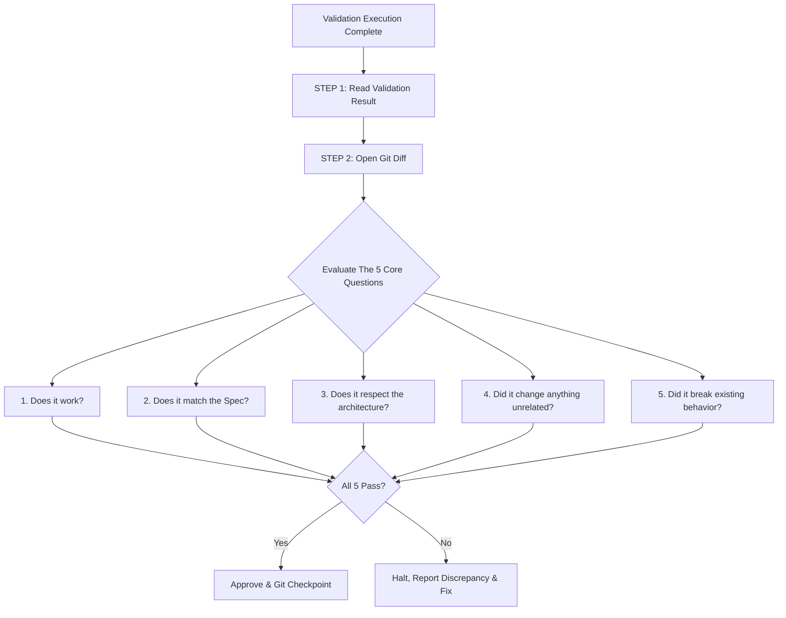

# SDD Post-Validation Review Skill (`review-after-validation`)

This skill defines the mandatory review gate executed immediately after running feature validation and before committing code to the repository.



---

## The 2-Step Review Workflow

### STEP 1: Read Validation Result
Before looking at code diffs, verify empirical evidence of execution:
1. **Automated Test Results**:
   - Inspect the terminal / test runner output (`pytest`, `vitest`, `npm test`, etc.).
   - Verify that all test cases passed (0 failures, 0 unhandled errors).
2. **Coverage of Applicable Tiers**:
   - Confirm that all tiers specified in the feature's `validation.md` were executed.
   - For any tiers marked `Not Applicable`, confirm that valid technical justifications were provided.
3. **Manual / CLI / Visual Checks**:
   - Review manual interaction logs or terminal run outputs (e.g. CLI runner execution, browser interaction status).

> ⚠️ **Gate Rule**: If the validation result contains failures, broken tests, or incomplete checks, **HALT immediately**. Do not proceed to diff review until validation is green.

---

### STEP 2: Open Git Diff
Inspect every changed line in the repository using git diff commands:
```powershell
# Inspect working tree diff
git diff

# Or inspect staged changes
git diff --staged

# Or inspect diff against base commit
git diff HEAD~1 HEAD --stat
```

Analyze the diff systematically against the **5 Core Review Questions**:

---

## The 5 Core Review Questions

### 1. Does it work? (هل تعمل الميزة فعلياً؟)
- **Criterion**: The implementation is fully functional and performs its intended purpose.
- **Verification**:
  - Is there concrete proof that the code executes successfully?
  - Are outputs, side effects, and state mutations accurate and verified by validation?
- **Failure Trigger**: Mock-only illusions, placeholder return statements (`TODO`, `pass`), or non-functional stubs.

### 2. Does it match the Spec? (هل تطابق الكود مع المواصفات؟)
- **Criterion**: The code strictly implements what was specified in `plan.md` and `requirements.md`.
- **Verification**:
  - Are all functional requirements (FRs) satisfied?
  - Are non-functional requirements (NFRs, latency budgets, formats) met?
  - Is there any **Scope Creep** (extra features or unrequested logic added without spec)?
- **Failure Trigger**: Missing requirements, altered business logic, or undocumented extra features.

### 3. Does it respect the architecture? (هل يحترم الكود المعمارية والمبادئ الهندسية؟)
- **Criterion**: Zero architectural drift. Code respects project rules in `spec/tech.md`.
- **Verification**:
  - Are architectural invariants upheld (e.g. latency budgets, barge-in rules, layer boundaries)?
  - Does the code follow established repository patterns (e.g., centralized `src/config.py`, proper schemas, separation of UI and business logic)?
  - Are imports clean, without circular dependencies or improper coupling?
- **Failure Trigger**: Bypassing centralized configuration, violating layer boundaries, or introducing unapproved dependencies.

### 4. Did it change anything unrelated? (هل غيّر الكود أي شيء غير متعلق بالميزة؟)
- **Criterion**: The diff is **minimal, focused, and surgical**.
- **Verification**:
  - Are all modified files directly tied to the target feature?
  - Are there accidental changes to unrelated files, formatting churn, or leftover debug statements (`console.log`, `print`, temporary scratch files)?
  - Are existing comments and docstrings preserved?
- **Failure Trigger**: Formatting-only noise across unrelated files, accidental deletions, or touching out-of-scope modules.

### 5. Did it break existing behavior? (هل كسر الكود أي سلوك سابق؟)
- **Criterion**: Zero regression across the existing codebase.
- **Verification**:
  - Did the full test suite pass cleanly across all repository modules?
  - Do existing APIs, endpoints, tools, and session states continue to function as expected?
- **Failure Trigger**: Broken existing tests, altered existing signatures without backward compatibility, or disrupted dependencies.

---

## Decision Matrix & Review Outcomes

| Outcome | Criteria | Next Action |
|:---|:---|:---|
| **APPROVED ✅** | All 5 questions answered with **YES** and backed by evidence. | 1. Update `spec/roadmap.md` and `TASK_PLAN.md` with `- [x]`.<br>2. Commit changes with semantic commit message.<br>3. Push to remote repository (`git push`).<br>4. Proceed to replanning / next feature. |
| **REVISION NEEDED 🛑** | Any question answered with **NO**. | 1. Document the exact discrepancy (which of the 5 questions failed).<br>2. Revert or refactor problematic changes.<br>3. Re-run validation (`STEP 1`).<br>4. Re-open diff (`STEP 2`). |

---

## Standard Review Report Template

When conducting a post-validation review, document the findings using this structured format:

```markdown
### Post-Validation Review Report: Feature <XXX>

#### 1. Validation Results Summary
- Automated Tests: <X passed, 0 failed>
- Manual / Visual Verification: <Passed / Verified>
- Static Checks (Build/Lint/Types): <Clean / Passed>

#### 2. The 5 Core Questions Evaluation
1. **Does it work?**: ✅ YES — <Evidence summary>
2. **Does it match the Spec?**: ✅ YES — <Alignment with requirements.md>
3. **Does it respect the architecture?**: ✅ YES — <Compliance with tech.md invariants>
4. **Did it change anything unrelated?**: ✅ YES — <Diff is minimal and clean>
5. **Did it break existing behavior?**: ✅ YES — <Full test suite passed with 0 regressions>

#### 3. Verdict
- **Status**: [APPROVED / REVISION NEEDED]
- **Next Step**: [Commit & Push / Refactor]
```
