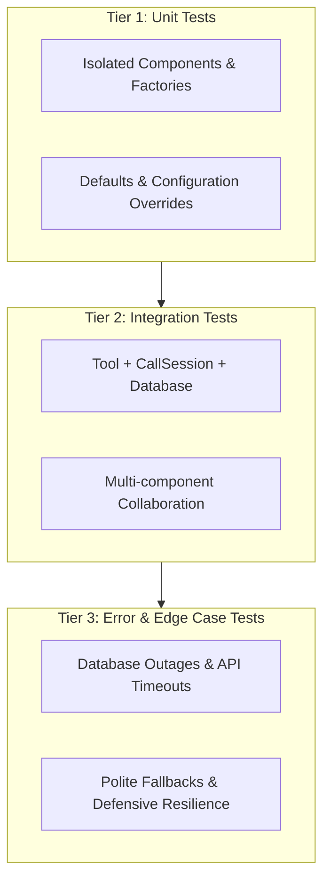

# Testing & QA Standards (`testing-standards`)

This skill defines the engineering standards, architecture, and invariant rules for writing, maintaining, and executing automated tests in this repository.

> 🛡️ **Tests are a Safety Net**: Every code modification must be verified through automated tests to guarantee zero regressions.  
> 🧩 **Isolate First, Integrate Next**: Validate atomic components before testing compound interactions.  
> 💥 **Design for Failure**: A production voice system must never crash on external failure; it must handle exceptions with polite, graceful fallbacks.

---

## 1. The Three Testing Tiers

Every feature, tool, and pipeline component must be validated across three distinct testing tiers:



### 1.1 Unit Tests (Component Isolation)
- **Definition**: Tests a single, focused unit of code in complete isolation from external networks, databases, or dependent subsystems.
- **Purpose**: Catch logic errors, signature mismatches, and configuration bugs within individual functions, factories, or schemas.
- **Reference Example in Codebase**:
  - `test_create_stt_factory_defaults` ([tests/test_agent.py](file:///d:/AI%20Projects/voice_agent/tests/test_agent.py#L80-L86)): Verifies Deepgram STT client initialization with default model and language settings without invoking live audio streams.
  - `test_create_llm_factory`, `test_create_tts_factory`, `test_create_vad_factory`.

### 1.2 Integration Tests (Multi-Component Cooperation)
- **Definition**: Tests the collaboration of multiple integrated components working in concert.
- **Purpose**: Catch contract discrepancies, state mutation bugs, and data flow issues across module boundaries.
- **Reference Example in Codebase**:
  - `test_tool_order_status_live_execution` ([tests/test_agent.py](file:///d:/AI%20Projects/voice_agent/tests/test_agent.py#L144-L160)): Tests the `get_order_status` tool executing against a `CallSession`, updating session context, recording tool call metrics, and appending structured messages to the history.

### 1.3 Error & Edge Case Tests (Defensive Resilience)
- **Definition**: Tests system behavior under abnormal, degraded, or catastrophic conditions (e.g., service unavailability, corrupted inputs, timeouts).
- **Purpose**: Ensure that unexpected errors never crash the real-time voice pipeline; instead, the agent must catch the fault, log telemetry, and return a graceful, polite fallback message to the caller.
- **Reference Example in Codebase**:
  - `test_tool_exception_returns_polite_fallback` ([tests/test_agent.py](file:///d:/AI%20Projects/voice_agent/tests/test_agent.py#L217-L233)): Simulates a database outage using `unittest.mock.patch` on `ORDER_DATABASE.get`, asserting that the tool catches the exception and returns a courteous fallback message rather than terminating the call.

---

## 2. The Test Isolation Invariant

### 2.1 The Principle
Every test must execute from a **clean, completely isolated state**. No test may rely upon or modify the state of another test.

> 📝 **The Exam Paper Analogy**:  
> In an examination room, every student receives a brand-new, clean exam sheet. No student inherits answers or notes written by another student. Similarly, each automated test must receive a brand-new fixture instance with zero side effects carried over.

### 2.2 Implementation Pattern (`fresh_session`)
Use dedicated pytest fixtures to produce pristine state for each test function:

```python
@pytest.fixture
def fresh_session() -> CallSession:
    """Create a fresh CallSession for testing, preventing cross-test pollution."""
    session = CallSession(
        room_name="test-voice-room-01",
        participant_identity="caller_test_01",
    )
    session.context.customer_phone = "+201012345678"
    return session
```

- **Invariant**: If test B fails when test A is skipped, or passes only when test A runs first, the test suite is defective. Tests must be order-independent.

---

## 3. The 7 Invariant Rules & Checklists

### Rule 1: Tests as Safety Net
- **Requirement**: Never treat code as done until automated tests pass.
- **Workflow Loop**:
  ```text
  Code Modification  -->  Execute Test Suite  -->  Verify Green Pass  -->  Commit & Push
  ```
- **Checklist**:
  - [ ] All relevant tests executed and passing.
  - [ ] No existing tests broken by new changes.
  - [ ] Zero unhandled warnings or lint regressions.

### Rule 2: Test Component in Isolation First
- **Requirement**: Before writing integration tests for a complex system, write unit tests for each factory, helper, and data schema.
- **Checklist**:
  - [ ] Factory constructors tested with default parameters.
  - [ ] Factory constructors tested with overridden/custom parameters.
  - [ ] Input validation models reject invalid payloads.

### Rule 3: Test Integration
- **Requirement**: Validate that interconnected units correctly mutate shared state, follow protocol contracts, and record telemetry.
- **Checklist**:
  - [ ] Session context accurately reflects tool execution results (e.g., `session.context.order_id`).
  - [ ] Metrics counters increment correctly (e.g., `session.metrics.total_tool_calls`).
  - [ ] Conversation history logs tool call results with role `MessageRole.TOOL`.

### Rule 4: Test Failures and Exceptions
- **Requirement**: For every tool and external integration, write at least one test simulating an unexpected failure.
- **Checklist**:
  - [ ] Simulated exception does not bubble up to crash the event loop.
  - [ ] User-facing response is polite, natural, and helpful.
  - [ ] Fallback response instructs caller on next steps (e.g., retry or supervisor handoff).

### Rule 5: Mock External Dependencies
- **Requirement**: Never call live third-party billing APIs, external webhooks, or production databases in automated unit/integration suites.
- **Tools**: Use `unittest.mock.patch`, `unittest.mock.MagicMock`, and `AsyncMock`.
- **Checklist**:
  - [ ] External network calls intercepted with mocks.
  - [ ] Mock return values accurately match production schema types.
  - [ ] Edge cases (e.g., HTTP 500, network timeouts) tested via mock side effects (`side_effect=Exception(...)`).

### Rule 6: Strict Isolation & Zero State Leakage
- **Requirement**: Clean up global state, mocks, and environment variables after each test.
- **Checklist**:
  - [ ] Use `pytest.fixture` with appropriate scope (`function` scope by default).
  - [ ] Autouse cleanup fixtures or context managers (`with patch(...)`) to avoid leaking mocks.
  - [ ] Tests run deterministically in any randomized order.

### Rule 7: Async Handling & Concurrency
- **Requirement**: LiveKit and voice pipelines rely heavily on asynchronous event loops (`asyncio`). Tests interacting with async components must use `pytest.mark.asyncio`.
- **Checklist**:
  - [ ] Async test functions declared with `async def` and decorated with `@pytest.mark.asyncio` (or configured via `asyncio_mode = "auto"`).
  - [ ] All coroutines awaited properly without leaving unawaited coroutine warnings.
  - [ ] Async mocks created with `AsyncMock` where coroutine semantics are expected.

---

## 4. SDD Workflow Alignment (`validation.md`)

When executing the Spec-Driven Development workflow defined in `.agents/skills/my-rule/SKILL.md`, step 6 requires generating `validation.md` for every feature.

### 4.1 Mapping the 3 Test Tiers to `validation.md`
Every feature's `validation.md` must organize its automated verification section using this 3-tier structure:

| Tier | Section in `validation.md` | Verification Criteria |
|:---|:---|:---|
| **Tier 1: Unit** | `### Automated Unit Tests` | Schema validation, factory defaults, helper logic |
| **Tier 2: Integration** | `### Automated Integration Tests` | End-to-end data flow across Session, Tool, and Storage |
| **Tier 3: Error & Edge Cases** | `### Automated Edge Case & Resilience Tests` | Disconnections, API timeouts, invalid inputs, fallback behavior |

> ⚖️ **Applicability & Exemption Rule**:  
> Do **not** fabricate artificial tests across all 3 tiers if one tier is genuinely not applicable to the feature.  
> - **Mandate**: All *applicable* testing tiers MUST be defined.  
> - **Exemption Requirement**: If a tier is not applicable, `validation.md` MUST explicitly state the exemption with a clear technical justification.  
> - *Example*:  
>   `### Tier 2: Integration Tests`  
>   `> **Status**: Not Applicable`  
>   `> **Justification**: Pure, isolated formatting utility with no cross-component behavior or persistent state mutation.`

### 4.2 Standard Test Execution Commands
- Run all tests:
  ```powershell
  uv run pytest -v
  ```
- Run a specific test suite:
  ```powershell
  uv run pytest tests/test_agent.py -v
  ```
- Run tests matching a specific pattern:
  ```powershell
  uv run pytest -k "test_tool_order_status" -v
  ```
- Run tests and halt on first failure:
  ```powershell
  uv run pytest -x
  ```
