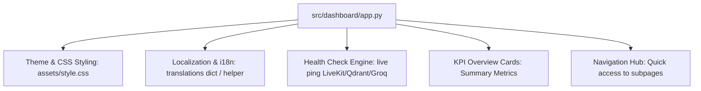

# Feature Plan: Feature 5.1 — Main Dashboard Entry & Design System

## 1. Objective
Establish the primary Streamlit administrative dashboard entry point (`src/dashboard/app.py`) for the Voice AI Agent platform. This feature implements:
- A dark, modern theme design system with custom CSS (glassmorphism, gradient accents, responsive cards).
- Bilingual support (Arabic & English) with seamless toggle and RTL styling.
- Live service health checks (LiveKit Cloud, Qdrant Vector DB, Groq LLM, ElevenLabs TTS).
- High-level KPI summary cards (latency budgets, total calls, active sessions, handoff rate).
- Navigation hub directing administrators to upcoming pages (Call Logs, Analytics, Knowledge Base, Settings).

---

## 2. Approach & Architecture

### Components:
1. **Entry Point (`src/dashboard/app.py`)**:
   - Sets page configuration (`st.set_page_config`) with page title, icon, and wide layout.
   - Loads and injects custom CSS for modern dark-mode glassmorphism aesthetics.
   - Manages language state (`session_state.lang`) between English and Arabic.
2. **Design System & CSS (`src/dashboard/assets/style.css`)**:
   - Custom CSS variables for color palette (dark slate `#0E1117`, card background `rgba(26, 32, 44, 0.7)`, vibrant neon accents `#FF4B4B`, `#00D26A`, `#00B4D8`).
   - Glassmorphic card styling, hover effects, status badge animations, and RTL text alignment classes when Arabic is selected.
3. **Localization / i18n (`src/dashboard/i18n.py`)**:
   - Clean translation dictionary mapping UI keys to English and Arabic strings.
   - Helper function `t(key)` for easy string retrieval with fallback.
4. **Health Check Module (`src/dashboard/health.py`)**:
   - Non-blocking checks for connected backend services:
     - LiveKit (URL & API Key presence)
     - Qdrant (client connection or in-memory availability)
     - Groq (API Key validation)
     - ElevenLabs (API Key validation)
   - Returns status badge data (`online`, `degraded`, `offline`).

---

## 3. Files to Create / Modify
- **Create**:
  - `src/dashboard/__init__.py`
  - `src/dashboard/app.py`
  - `src/dashboard/i18n.py`
  - `src/dashboard/health.py`
  - `src/dashboard/assets/style.css`
  - `tests/test_dashboard_app.py`
- **Modify**:
  - `TASK_PLAN.md` (Track progress)
  - `spec/roadmap.md` (Update status after completion)

---

## 4. Execution Breakdown
1. **Step 1: Design System & Styling**:
   - Create `src/dashboard/assets/style.css` with dark theme tokens, glassmorphism, metric card styles, and RTL support.
2. **Step 2: Localization Infrastructure**:
   - Create `src/dashboard/i18n.py` containing complete bilingual string catalogs (EN/AR) for all dashboard UI components.
3. **Step 3: Service Health & Diagnostic Helper**:
   - Create `src/dashboard/health.py` to inspect credentials, ping Qdrant and LiveKit endpoints safely without raising unhandled exceptions.
4. **Step 4: Main Application Assembly**:
   - Create `src/dashboard/app.py` integrating page setup, CSS injection, language switcher in sidebar, KPI overview, live status panel, and navigation cards.
5. **Step 5: 3-Tier Automated Tests**:
   - Write comprehensive tests in `tests/test_dashboard_app.py` (Unit tests for i18n and health, AppTest for Streamlit UI rendering, and edge case resilience).
