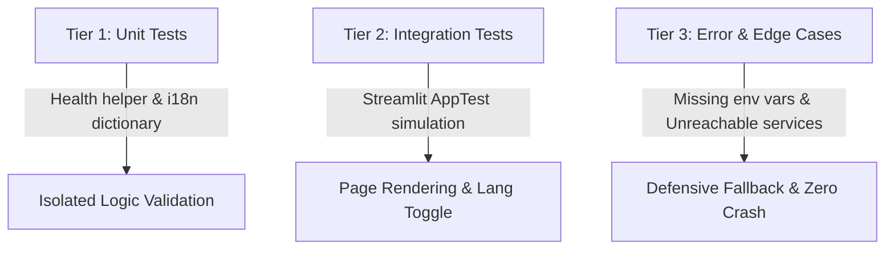

# Validation Criteria: Feature 5.1 — Main Dashboard Entry & Design System

## 1. 3-Tier Testing Architecture



---

### Tier 1: Unit Tests
- **Target Module**: `src/dashboard/i18n.py` and `src/dashboard/health.py`
- **Coverage**:
  - `test_i18n_translation_keys_completeness`: Verify all translation keys exist in both English (`en`) and Arabic (`ar`) dictionaries.
  - `test_i18n_fallback_behavior`: Verify that querying an unknown key returns the key itself as a fallback rather than raising `KeyError`.
  - `test_health_checker_structure`: Verify `check_services_health()` returns a dictionary containing all expected services (`livekit`, `qdrant`, `groq`, `elevenlabs`, `deepgram`) with valid status attributes (`status`, `label`, `message`).
  - `test_css_asset_exists`: Verify `src/dashboard/assets/style.css` is present and contains core dark-mode and RTL class definitions.

### Tier 2: Integration Tests
- **Target Module**: `src/dashboard/app.py` via `streamlit.testing.v1.AppTest`
- **Coverage**:
  - `test_dashboard_app_renders_cleanly`: Initialize `AppTest.from_file("src/dashboard/app.py")`, run the script, and assert `at.exception` is empty (zero unhandled exceptions).
  - `test_dashboard_kpi_metrics_rendered`: Verify that all 4 KPI metric elements are rendered on the page with correct labels and values.
  - `test_dashboard_language_toggle_integration`: Simulate toggling the language radio selector from English to Arabic in `session_state`, re-run, and verify that page headers update to their Arabic equivalents.
  - `test_service_status_badges_rendered`: Verify that the service health cards/badges appear in the sidebar or main panel.

### Tier 3: Error & Edge Case Tests
- **Target Module**: `src/dashboard/health.py` & `src/dashboard/app.py`
- **Coverage**:
  - `test_health_checker_with_missing_env_vars`: Mock empty configuration settings (`settings.livekit_url = ""`, etc.) and ensure `check_services_health()` returns `offline` / `unconfigured` status without raising exceptions.
  - `test_health_checker_with_network_exception`: Mock a network connection timeout when pinging Qdrant / LiveKit and verify it returns `degraded` / `offline` gracefully.
  - `test_app_resilience_under_missing_css`: Mock missing `style.css` file and ensure the dashboard still renders without crashing.

---

## 2. Test Isolation Invariant
- Every test must run in a clean isolated context.
- Streamlit `session_state` must be reset before each test using a pytest fixture:
  ```python
  @pytest.fixture(autouse=True)
  def reset_streamlit_state():
      yield
      # Clean up any state mocks
  ```

---

## 3. Automated Verification Commands
```powershell
# Run the complete test suite for the dashboard entry feature
uv run pytest tests/test_dashboard_app.py -v --tb=short
```

---

## 4. Manual / Visual Verification Checklist
1. Launch the Streamlit dashboard:
   ```powershell
   uv run streamlit run src/dashboard/app.py
   ```
2. Verify visual appearance:
   - Modern dark slate background (`#0E1117`).
   - Glassmorphic card styling with subtle borders.
   - Vibrant KPI cards with latency target `< 800ms`.
3. Test language switching:
   - Select **العربية** in the sidebar.
   - Confirm Arabic text is displayed and layout aligns cleanly (RTL).
   - Switch back to **English** and verify instant update.
4. Verify service health indicators:
   - Green / Yellow / Red badges reflect current environment credentials.
