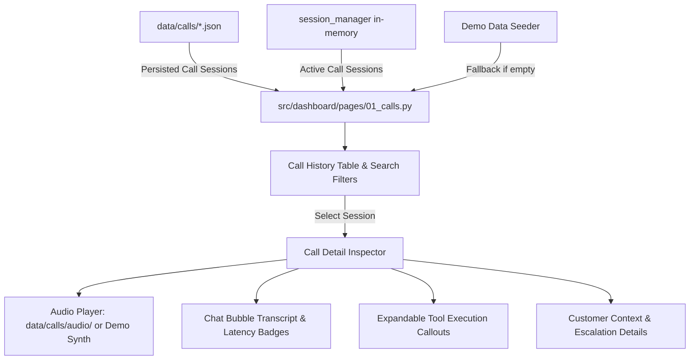

# Feature Plan: Feature 5.2 — Call Logs, Audio Playback & Transcript Viewer

## 1. Objective & Business Value
Establish an operational call intelligence page (`src/dashboard/pages/01_calls.py`) within the Streamlit dashboard.
This feature enables restaurant supervisors and QA managers to:
- Review call sessions across active, completed, and escalated states.
- Filter and search calls by status, sentiment, customer phone, order ID, and date range.
- Inspect full conversation transcripts in a modern chat bubble interface with per-turn latency telemetry (STT, LLM, TTS).
- Trace tool execution payloads and outputs (menu RAG queries, order lookups, table reservations, human handoffs).
- Listen to call audio recordings from `data/calls/audio/` with seamless synthetic audio sample fallback.
- Auto-seed realistic demo call sessions (Arabic and English) when storage is empty, ensuring immediate visual feedback.

---

## 2. Scope & Exclusions

### In Scope:
- **Call Session Explorer Table**: Interactive, searchable table displaying session ID, customer contact, language, duration, total turns, average latency, and outcome status.
- **Multi-criteria Filtering**: Filter by call status (`All`, `Active`, `Ended`, `Escalated`), sentiment (`Positive`, `Neutral`, `Negative`), language (`All`, `Arabic`, `English`), and search query.
- **Detailed Call Inspector Drawer/View**: Deep dive into a selected call session showing:
  - Header with caller metadata, room name, total cost/latency, and escalation badge.
  - Audio playback bar: stream from `data/calls/audio/<session_id>.wav` or `.mp3`, with graceful fallback to synthesized demo audio when no physical recording is present.
  - Chat bubble transcript rendering: distinct user vs assistant styling, RTL support for Arabic turns, interruption tags (`⚡ Interrupted`), and turn timestamp.
  - Expandable Tool Execution Cards: visual inspection of tool name, input arguments, and returned JSON results.
  - Latency Waterfall Badge: per-turn breakdown of STT (Deepgram), LLM (Groq), and TTS (ElevenLabs) latency metrics.
- **Auto-Seeding Utility**: Helper to generate 4-5 high-fidelity mock restaurant calls (bilingual orders, reservations, and human escalation) if `data/calls/` contains no JSON records.
- **Bilingual & RTL Compatibility**: Seamless switching between English and Arabic layouts consistent with `app.py`.

### Out of Scope:
- Telephony SIP trunk recording ingest (deferred to LiveKit Egress Cloud service in Phase 6).
- Direct audio waveform editing or annotation.
- Re-running live calls from the dashboard (read-only monitoring view).

---

## 3. Relevant Architecture & Data Flow

### Components:
1. **Call Data Service (`src/dashboard/calls_data.py`)**:
   - Encapsulates loading sessions from disk (`SessionManager.load_all_persisted_sessions()`) and merging with active in-memory sessions.
   - Provides seed generator creating realistic restaurant calls (Shawarma order tracking, table booking, menu allergen inquiry, delivery complaint escalation).
   - Audio resolution utility checking `data/calls/audio/<session_id>.*` and returning audio bytes or demo synthetic fallback.
2. **Page View (`src/dashboard/pages/01_calls.py`)**:
   - Streamlit multi-page module adopting shared design tokens from `assets/style.css` and translations from `i18n.py`.
   - Sidebar filters (status, language, search term).
   - Summary metric badges for filtered call set.
   - Master-detail split: Master table above, detail inspector below.
3. **Localization (`src/dashboard/i18n.py`)**:
   - Extended catalog with keys for call logs, transcript roles, tool traces, audio player controls, and filter labels in both EN and AR.

---

## 4. Files Affected & Created

- **Create**:
  - `src/dashboard/pages/01_calls.py`: The Streamlit page for call logs and transcript inspection.
  - `src/dashboard/calls_data.py`: Data access, seeding, filtering, and audio resolution helpers.
  - `tests/test_calls_page.py`: 3-tier test suite (Unit, Integration AppTest, and Edge cases).
- **Modify**:
  - `src/dashboard/i18n.py`: Add all necessary translations for Call Logs UI.
  - `src/dashboard/assets/style.css`: Add styles for chat bubbles, audio container, tool cards, and turn latency tags.
  - `TASK_PLAN.md`: Track progress and task completion.
  - `spec/roadmap.md`: Update Feature 5.2 status upon completion.

---

## 5. Manageable Execution Groups

1. **Group 1: Data Access & Seed Generator (`calls_data.py` + i18n & CSS)**:
   - Implement session loading, seed session creator, audio resolver.
   - Update `i18n.py` with English and Arabic dictionaries for call inspection.
   - Add chat bubble, badge, and tool card CSS to `style.css`.
2. **Group 2: Streamlit Page Implementation (`01_calls.py`)**:
   - Build header, sidebar filters, master call summary table.
   - Build detail view: audio player, customer context card, chat transcript, tool cards, and latency breakdown.
3. **Group 3: Automated Validation & 3-Tier Tests (`test_calls_page.py`)**:
   - Unit tests for data loading, filtering, and audio resolution.
   - Integration tests via `streamlit.testing.v1.AppTest`.
   - Error/edge case tests (corrupt JSON, empty directory, missing audio).

---

## 6. Risks & Trade-Offs

| Risk / Trade-Off | Mitigation |
|:---|:---|
| Large number of persisted JSON call files slowing down page load | Implement caching (`st.cache_data`) and pagination or limit to top 50 recent calls by default. |
| Missing audio recordings for real or test sessions | Audio resolver detects missing files and produces an elegant synthetic WAV notification or clear demo badge without failing. |
| Mixed Arabic and English turns within the same call | Per-turn text direction detection: Arabic turns automatically receive `dir="rtl"` styling, while English turns remain `dir="ltr"`. |
