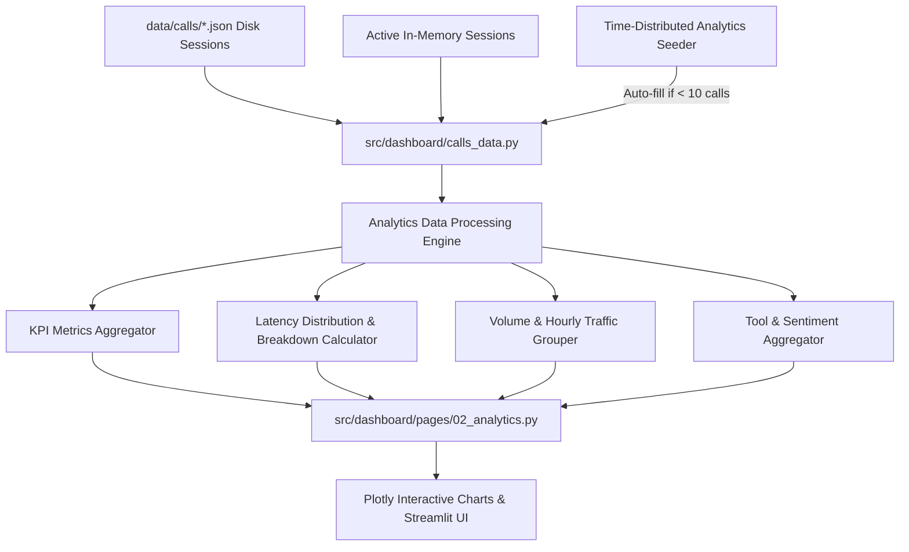

# Feature Plan: Feature 5.3 — Latency Charts & Call Volume Analytics

## 1. Objective & Business Value
Establish an executive and operational intelligence page (`src/dashboard/pages/02_analytics.py`) within the Streamlit admin portal.
This feature enables restaurant managers, system administrators, and voice engineers to:
- Monitor end-to-end conversational latency performance against the **800ms SLA budget** specified in `spec/tech.md`.
- Analyze sub-component latency breakdowns: **STT (<200ms)**, **LLM TTFT (<300ms)**, and **TTS (<250ms)**.
- Track call traffic volume across hourly rush hours and daily historical trends to optimize restaurant staffing and server capacity.
- Inspect customer sentiment distribution (Positive, Neutral, Negative) and human escalation rates.
- Evaluate domain AI tool invocation patterns (order lookups, reservations, knowledge searches, and escalations).
- Gain immediate, realistic insights via an automatic time-distributed session seeding engine when actual call history is sparse.

---

## 2. Scope & Exclusions

### In Scope:
- **Executive KPI Summary Cards**:
  - Total Call Sessions.
  - Average End-to-End Latency (ms) with SLA adherence status indicator.
  - Voice SLA Compliance Rate (`% of turns < 800ms`).
  - Human Escalation Rate (`% escalated to supervisor`).
  - Total Talk Time / Average Call Duration.
- **Latency Telemetry & SLA Compliance (Plotly Charts)**:
  - **Component Breakdown Chart**: Stacked bar or multi-bar comparing Deepgram STT, Groq LLM, and ElevenLabs TTS latency with constitutional target thresholds.
  - **Latency Distribution Histogram / Boxplot**: Distribution of total turn turnaround times highlighting p50, p95, and outliers exceeding the 800ms SLA.
- **Call Volume & Peak Traffic Trends (Plotly Charts)**:
  - **Time Series Volume**: Daily and hourly call volume line/bar chart showing peak rush hours (lunch 12:00-15:00, dinner 19:00-22:00).
  - **Call Outcome Status Breakdown**: Volume segmented by completed, escalated, and active.
- **Domain & Conversational Intelligence**:
  - **Customer Sentiment Distribution**: Donut chart (Positive, Neutral, Negative).
  - **AI Tool Usage Frequencies**: Horizontal bar chart comparing invocations of `check_order_status`, `book_reservation`, `search_knowledge_base`, and `escalate_to_human`.
  - **Language Split**: Proportional breakdown between Arabic (`ar`) and English (`en`).
- **Interactive Multi-Criteria Slicers**:
  - Date Range Filter (Today / Last 24 Hours, Last 7 Days, Last 30 Days, All Time).
  - Language Filter (All, Arabic, English).
  - Call Status Filter (All, Completed, Escalated).
- **Time-Distributed Analytics Seeder**:
  - Generates realistic, time-stamped call sessions spanning the last 7 days if stored call records are fewer than 10, ensuring charts render meaningful trends immediately.
- **Bilingual (Arabic & English) and RTL Support**:
  - Seamless toggle between Arabic and English via `i18n.py`.
  - Plotly chart labels, legends, tooltips, and dashboard layout adapt to selected language and direction.

### Out of Scope:
- External BI export to Snowflake/BigQuery (deferred to Phase 6 enterprise integrations).
- Real-time WebRTC audio jitter and packet loss graphing (telephony network QoS is handled by LiveKit Cloud telemetry).
- Live streaming socket updates (page leverages Streamlit's native reactive state and manual refresh button).

---

## 3. Relevant Architecture & Data Flow

### Components & Responsibilities:
1. **Analytics Data Aggregator (`src/dashboard/analytics_data.py`)**:
   - Computes statistical metrics: mean, median, p95 latency, SLA compliance percentages.
   - Groups call sessions by hourly intervals and calendar dates for time-series charts.
   - Extracts and tabulates tool invocation frequencies and sentiment distributions.
   - Supplies time-distributed mock session generator for 7-day realistic trends.
2. **Analytics Page UI (`src/dashboard/pages/02_analytics.py`)**:
   - Renders executive KPI summary cards with Delta indicators.
   - Renders responsive, dark-theme Plotly visualizations aligned with `assets/style.css`.
   - Incorporates sidebar filters for date range, language, and status.
3. **Localization Updates (`src/dashboard/i18n.py`)**:
   - Comprehensive Arabic and English dictionary entries for all KPI titles, chart axes, legends, tooltips, and filter controls.

---

## 4. Affected & Created Files

- **Create**:
  - `src/dashboard/analytics_data.py`: Metric calculation, aggregation pipelines, time-distribution seeder.
  - `src/dashboard/pages/02_analytics.py`: Streamlit analytics page with Plotly charts.
  - `tests/test_analytics_page.py`: Automated 3-tier validation test suite.
  - `spec/features/feature-503-latency-charts-call-volume-analytics/plan.md`: Feature implementation plan.
  - `spec/features/feature-503-latency-charts-call-volume-analytics/requirements.md`: Testable requirements specification.
  - `spec/features/feature-503-latency-charts-call-volume-analytics/validation.md`: 3-tier validation criteria and test plan.
- **Modify**:
  - `src/dashboard/i18n.py`: Add all analytics labels, tooltips, and chart texts in EN & AR.
  - `src/dashboard/assets/style.css`: Chart container styling, KPI card refinements.
  - `TASK_PLAN.md`: Track execution progress.
  - `spec/roadmap.md`: Update Feature 5.3 status upon completion.

---

## 5. Manageable Execution Groups

1. **Step 5.3.1: Data Aggregation & Seeding Engine (`analytics_data.py`, i18n & CSS)**:
   - Build metrics computation utilities (averages, p95, SLA rate, tool frequencies, hourly buckets).
   - Implement realistic 7-day time-distributed demo call seeder.
   - Update `i18n.py` with bilingual terms for analytics and charts.
   - Add styling rules in `style.css` for metric grids and Plotly cards.
2. **Step 5.3.2: Analytics Streamlit Page (`pages/02_analytics.py`)**:
   - Construct executive KPI cards (Calls, Latency, SLA %, Escalations, Duration).
   - Build Latency Telemetry charts: Component Breakdown (STT/LLM/TTS) and SLA distribution histogram.
   - Build Traffic Volume charts: Hourly rush-hour distribution and daily call volume.
   - Build Conversational Insights: Sentiment donut, tool frequency bar, and language split.
   - Implement sidebar date range and language filters.
3. **Step 5.3.3: 3-Tier Automated Validation Suite (`tests/test_analytics_page.py`)**:
   - Tier 1: Unit tests for data aggregations, SLA calculations, and percentile mathematics.
   - Tier 2: Integration tests via `streamlit.testing.v1.AppTest` verifying page rendering without exceptions.
   - Tier 3: Error & edge-case handling (zero calls, single call, missing latency keys).

---

## 6. Risks & Trade-Offs

| Risk / Trade-Off | Mitigation |
|:---|:---|
| Plotly default theme clashes with Streamlit dark mode | Configure custom Plotly layout templates with dark surface `#1a1d24`, accent `#6366f1`, and transparent backgrounds matching `style.css`. |
| Computation lag when aggregating thousands of turns | Utilize vectorized Pandas aggregations and `@st.cache_data(ttl=60)` for fast metric calculation. |
| Mixed turn latency reporting (some turns lack STT or TTS timestamps) | Defensive normalization filtering only assistant turns with measured latencies for component breakdowns. |
